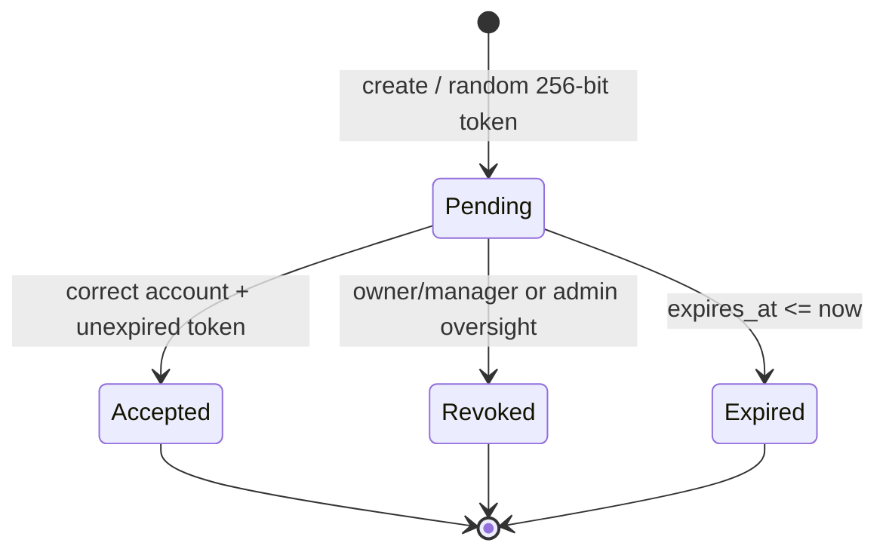
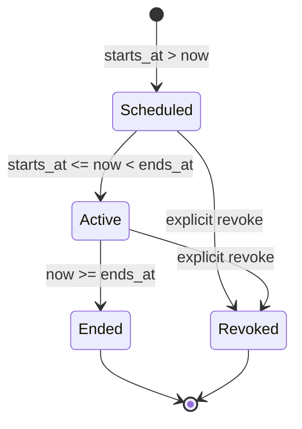

# ROSTA PS5.2 — Seller Organization & Availability Handoff

## Baseline and ownership

- Baseline: `integration/rosta-release-candidate@2a6f583b4c2f707104b53bf67cdbcc7eff1276dc`
- Branch: `phase/rosta-ps5b-seller-organization`
- PR: `#77`
- PS5.2 does **not** own lockfiles, tax, commission, refund, payout, carrier, deploy, or checkout pricing.
- `QuoteService` pricing behavior remains owned by PS4.1 and is intentionally unchanged.

## Permission model

`roastery_memberships` is the authoritative seller organization membership store. Legacy scoped `user_roles` aliases are synchronized only for compatibility with older middleware/UI surfaces; authorization decisions use `SellerAccess` and the membership role.

| Permission | owner | manager | catalog | fulfillment | finance | support |
|---|---:|---:|---:|---:|---:|---:|
| workspace.read | ✓ | ✓ | ✓ | ✓ | ✓ | ✓ |
| organization.read | ✓ | ✓ | — | — | — | — |
| organization.manage | ✓ | ✓* | — | — | — | — |
| catalog.read/write | ✓ | ✓ | ✓ | — | — | — |
| inventory.read/write | ✓ | ✓ | ✓ | ✓ | — | — |
| orders.read | ✓ | ✓ | — | ✓ | — | ✓ |
| fulfillment.write | ✓ | ✓ | — | ✓ | — | — |
| finance.read | ✓ | ✓ | — | — | ✓ | — |
| availability.read | ✓ | ✓ | ✓ | ✓ | ✓ | ✓ |
| availability.write | ✓ | ✓ | — | — | — | — |
| promotion.read/write | ✓ | ✓ | — | — | — | — |

`*` Manager cannot create/promote/demote/remove Owner or Manager memberships. Owner transitions additionally obey the last-active-owner invariant.

Administrator is not an implicit seller. Administrator oversight is limited to read, invitation revoke, and membership lock/unlock. Seller write routes reject administrator bypass. There is no impersonation endpoint or hidden seller session.

### IDOR behavior

- Authenticated member asking for a roastery outside their membership scope receives `404`, not membership details.
- Authenticated member inside scope but lacking the operation permission receives `403`.
- Unknown scoped seller route names fail closed in `EnforceSellerPermission`.
- A locked membership no longer receives a compatibility seller role and cannot fall back to legacy membership authorization.

## Invitation lifecycle

Security invariants:

- Raw token is returned once by create and may be placed in the encrypted notification outbox payload.
- Database invitation row stores only `SHA-256(token)`.
- Target mobile is normalized, encrypted at rest, and separately hashed for account binding/lookups.
- Existing account ID is bound when known; acceptance also requires the authenticated account mobile hash to match.
- Acceptance locks the invite row and unique `(roastery_id,user_id)` membership prevents duplicate membership under races.
- Accepted, revoked and expired invitations cannot be replayed.
- Public/list/admin responses expose only masked mobile values; token/hash are never listed.

## Owner lifecycle

Removal, demotion, or administrative locking of the last active Owner is rejected transactionally. The roastery and membership/owner set are locked before the invariant is evaluated. A controlled transfer therefore requires another active Owner to exist first.

## Availability policy

Weekly hours and date exceptions are interpreted in the roastery IANA timezone. Overnight ranges are represented by a closing time less than the opening time and continue into the next local day. DST conversion is delegated to the timezone database/Carbon rather than fixed offsets.

The explicit order policy is:

1. Weekly hours and exception dates determine `operating_now` and `next_open_at`.
2. Being outside weekly hours does **not** by itself reject a new order in PS5.2.
3. An active temporary closure with `blocks_new_orders=true` rejects Cart validation and Checkout Quote with `409 cart.roastery_temporarily_closed`.
4. A closure with `blocks_new_orders=false` changes public operational truth but still permits Cart/Checkout.
5. Closure activity is derived from `starts_at <= now < ends_at` and `revoked_at IS NULL`, so it auto-reopens after `ends_at` without a scheduler write.
6. Public roastery/product envelopes and Cart/Checkout all use the same `RoasteryAvailability` authority.

### Closure lifecycle

Overlapping non-revoked closure ranges for the same roastery are rejected while holding a roastery lock. Public reasons are limited to 180 characters and reject URLs, email-like `@` values and Iranian-mobile-like values.

## Promotion boundary

PS5.2 implements only independent lifecycle state:

- `draft`
- `scheduled`
- `paused`
- `expired`

The model/API contains no price, discount percentage, coupon, commission, or money field. UI likewise has no pricing input and returns `pricing_applied=false`.

**Not complete end-to-end:** Promotion lifecycle has no pricing effect in PS5.2. A later integration owned/coordinated with PS4.1 must define how an eligible scheduled promotion becomes an input to authoritative server-side quote pricing without allowing seller-controlled money mutation. Until that integration is designed/tested under financial ownership, “promotion discount application” must not be reported complete.

## API list

Seller:

- `POST /api/v1/seller/invitations/accept`
- `GET /api/v1/seller/roasteries/{roasteryId}/organization`
- `GET /api/v1/seller/roasteries/{roasteryId}/members`
- `PATCH|DELETE /api/v1/seller/roasteries/{roasteryId}/members/{membershipId}`
- `GET|POST /api/v1/seller/roasteries/{roasteryId}/invitations`
- `DELETE /api/v1/seller/roasteries/{roasteryId}/invitations/{inviteId}`
- `GET|PUT /api/v1/seller/roasteries/{roasteryId}/schedule`
- `GET|POST /api/v1/seller/roasteries/{roasteryId}/closures`
- `DELETE /api/v1/seller/roasteries/{roasteryId}/closures/{closureId}`
- `GET|POST /api/v1/seller/roasteries/{roasteryId}/promotions`
- `PATCH /api/v1/seller/roasteries/{roasteryId}/promotions/{promotionId}`

Admin oversight:

- `GET /api/v1/admin/seller-organizations/roasteries/{roasteryId}`
- `POST /api/v1/admin/seller-organizations/invitations/{inviteId}/revoke`
- `PATCH /api/v1/admin/seller-organizations/memberships/{membershipId}/lock`

Public availability truth is added as top-level `availability` metadata to public roastery/product resource envelopes to preserve the existing strict nested product/roastery wire contracts.

Full request/response contract: `docs/openapi/rosta-v1-seller-organization.yaml`.

## Migration notes

Migration: `backend/database/migrations/2026_08_14_000001_create_seller_organization_tables.php`

- Adds `roasteries.timezone` defaulting to `Asia/Tehran` for existing records.
- Creates memberships, invitations, weekly hours, date exceptions, closures, and promotion lifecycle tables.
- Backfills legacy seller assignments in precedence order: `roastery_staff → catalog`, `roastery_manager → manager`, `roastery_owner → owner`, so stronger existing ownership wins if duplicate legacy assignments exist.
- Existing record identifiers are preserved during backfill/update; new ULIDs are generated only for inserts.
- Adds invite/closure notification templates while preserving an existing template ID if the key already exists.
- New roasteries create an authoritative Owner membership and a compatibility scoped `roastery_owner` assignment in the same transaction.

## Notification and audit events

Notification outbox:

- `seller.invite`
- `seller.closure.started`
- `seller.closure.ended`

Audit event families:

- `seller.organization.invite.*`
- `seller.organization.member.*`
- `seller.availability.schedule.updated`
- `seller.availability.closure.*`
- `seller.promotion.*`
- `admin.seller.invite.revoked`
- `admin.seller.membership.locked|unlocked`

Audit metadata stores scoped IDs/roles/timestamps and not raw invitation tokens or full target mobile values.

## UI

`/panel/organization` provides:

- organization/permission summary based on scoped API permission truth,
- account-bound invite acceptance,
- member role management/removal with confirmation,
- invitation create/revoke and one-time token display,
- timezone/weekly/overnight schedule editing,
- date exceptions,
- closure create/revoke with explicit order-block policy,
- promotion lifecycle only,
- loading/error/empty/success states,
- RTL layout, native keyboard controls, focus rings, labels/fieldsets, and responsive grids.

UI visibility is only convenience; the server permission middleware remains authoritative.

## Acceptance tests

- `SellerPermissionMatrixTest` — every mapped Seller route against every membership role and fail-closed unknown route.
- `SellerOrganizationSecurityTest` — representative real endpoint permissions, cross-roastery IDOR, administrator oversight/no seller writes.
- `SellerInvitationLifecycleTest` — hashed/encrypted-at-rest invite material, account binding, expiry, revoke, replay and last-owner invariant.
- `SellerAvailabilityTest` — IANA timezone, Europe/Amsterdam DST, overnight hours, exception override, closure overlap, auto-reopen, public/product/cart/checkout truth.
- `SellerOrganizationOpenApiTest` — route/schema drift and promotion pricing-field exclusion.

Final command/exit-code and GitHub Actions evidence is recorded in PR #77 only after the final head passes all required gates.

## Expected Wave-2 conflict surfaces

Likely textual/integration conflicts with sibling phases:

- `backend/routes/api.php`
- `backend/app/Providers/AppServiceProvider.php`
- `backend/app/Http/Controllers/Checkout/CartController.php`
- `backend/app/Http/Controllers/Checkout/CheckoutQuoteController.php`
- public Catalog controllers
- `src/routes/panel.index.tsx`
- generated `src/routeTree.gen.ts`

Semantic ownership note: if PS4.1 changes checkout controllers, preserve the PS5.2 pre-quote `SellerAvailabilityGuard` call but do not move availability policy into pricing logic without financial-owner review.
